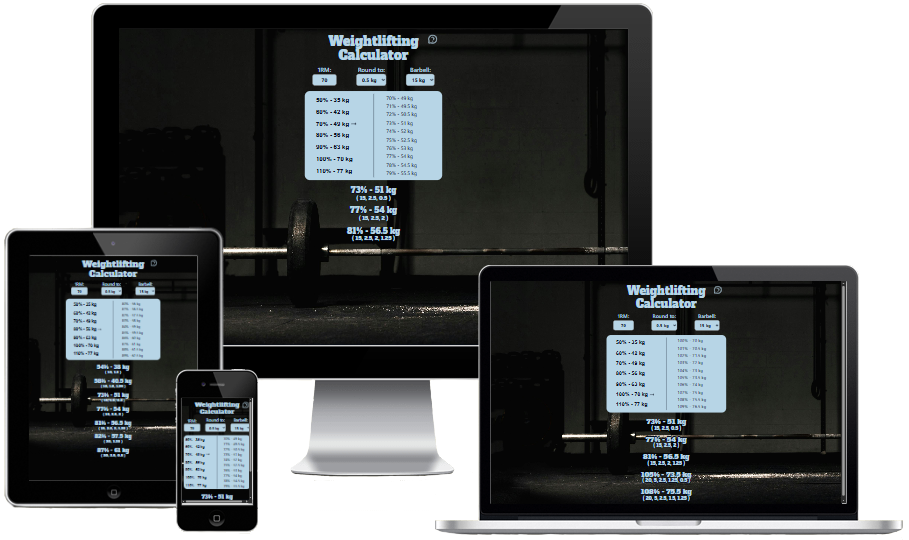
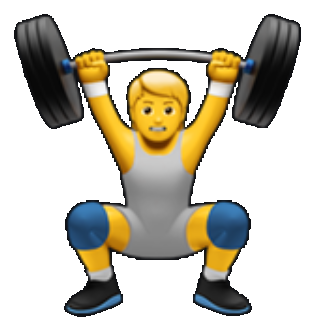

<div align="center">



Link to live website: [Weightlifting Calculator](https://niclo1337.github.io/weightlifting-calculator)

[](LICENSE)
[](https://niclo1337.github.io/weightlifting-calculator)
[](https://react.dev/)

</div>

#  Weightlifting Calculator

A simple React-based tool to help lifters quickly calculate training weights from their 1RM (one-rep max). </br>
Instead of doing the math in your head or looking up tables, this app shows you exactly how much weight to load on the bar for different intensity percentages.

## ✨ Why use it?

✅ Stop guessing what 74% of 137.5kg is — get the exact number instantly.

✅ Plan sessions more efficiently by saving your current working percentages.

✅ Get plate breakdowns for your barbell (based on available plates).

✅ Works directly in your browser — no installation required (but you can install it as a PWA if you want offline support).

## 🔑 Key Features

- 1RM Input – enter your current one-rep max and all calculations update instantly.

- Percentage List – quickly check common training zones (50%, 60%, 70%, 80%, 90%, 100%).

- Detailed Ranges – click a percentage to expand and view all weights in that range (e.g., 70–79%).

- Saved Percentages – save your frequently used percentages (e.g., 68%, 76%, 82%) for quick reference.

- Custom Rounding – round to your preferred increment (0.5kg, 1kg, 2.5kg, etc.).

- Barbell Plate Calculator – see which plates to load on each side of the bar, based on available gym plates.

- Local Storage Support – your settings and saved percentages persist even if you close the browser.


## 🧾 License

This project is licensed under the MIT License © [Niclas](LICENSE)

In short that means you are free to:

✅ Use the code for personal or commercial projects

✅ Modify it to fit your needs

✅ Share it or redistribute it


## 🛠️ Installation for local development

1️⃣ Clone the repository:

```bash
git clone https://github.com/NiclO1337/weightlifting-calculator.git
```

2️⃣ Navigate to project directory:

```bash
cd weightlifting-calculator
```

3️⃣ Install dependencies:

```bash
npm install
```

4️⃣ Run development server:

```bash
npm run dev
```

5️⃣ Open in browser:

Click link to localhost in the terminal.

## 🚀 Deploy your own version to GitHub pages

1️⃣ Create a new empty repository on your GitHub account.

2️⃣ Change the git remote from cloned project to your new repo:

```bash
git remote remove origin
git remote add origin https://github.com/<your-username>/<your-repo>.git
```

3️⃣ Edit vite.config.js file:

Change this line to your repository name: (keep the / before name)

```
base: "/<your-repo>",
```

4️⃣ Edit package.json file:

Change this line to your username and repository name:

```
"homepage": "https://<your-username>.github.io/<your-repo>",
```

5️⃣ Add and commit the changes:

```
git add .
git commit -m "Configure repo for GitHub Pages deployment"
```

6️⃣ Push everything to your repo:

```bash
git push -u origin main
```

7️⃣ Deploy to GitHub pages:

```bash
npm run deploy
```


## 👌 Credits

### Background image
Photo by Messina Photo: [Link to image on pexels.com](https://www.pexels.com/photo/man-inside-a-gym-near-a-barbell-8170745/)


